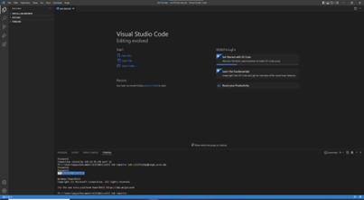
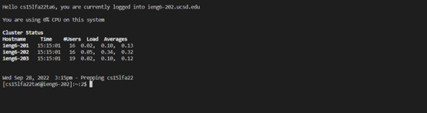
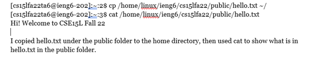
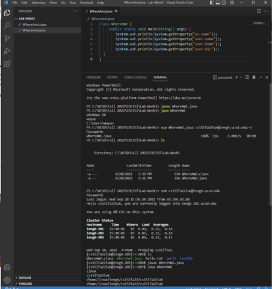
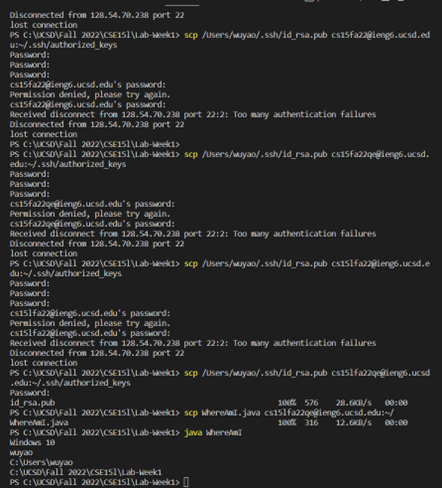
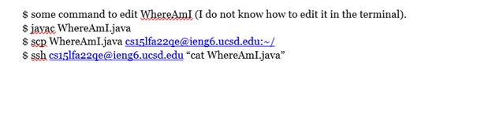

# Remote Access #
This tutorial will teach you how to log into a course-specific account on `ieng6`. You might encounter problems. But the one thing you need to have is **patience**.
### LET'S GO! ###
## 1.Install VScode. ##
Go to https://code.visualstudio.com/ and download Visual Studio Code on your computer. Remember to choose the correct version according to your operating system. After downloading successfully. open VScode. It should look like the following picture.

## 2.Remotely Connect ##
You need to set up your course account's password. For cse15l, it should be cs15ltime**. *e.g. cs15lfa22zz.*

 Then open a terminal, whether in a editor or command prompt. Use `ssh youraccount@ieng6.ucsd.edu` to login. Enter your password when it shows up. **Notice: Nothing will show up when you enter your password.**|

 Here is what you will see after logging in.

 

 ## 3.Try Some Commands ##
 Try the some of the following commands in the interminal.

 **cd ~**

 **cd**

 **ls**

 **ls -lat**

 **ls (directory)**

 **cp (file) (directory)**

 **cat file**

 Some examples:

 

 ## 4. Move Files with `scp` ##
 We are now trying to copy some files to your remote computers. First, create a file called WhereAmI.java on your local computers. Then use `javac` to compile it. Next, we apply `scp` in this format: `scp (file) (remote computer directory)` You need to enter your password for your course account at this point.

 

 ## 5. Setting an SSH Key ##
 We need to enter the passcode each time we switch between our client and remote computer. Is there any ways we can advance this process?

 **Yes.**

 We use SSH Key to achieve this. Follow the instructions. **(For Windows, you need a extra step `ssh-add`)

## 6. Optimizing Remote Running ##
Remember WhereAmI.java?
We now need to edit WhereAmI.java on our computers and update it on the remoter computers. Then we want to open the files on that. Is there any possible process?

**Notice: we can use `$ ssh (account) "(command)"` to log into ssh and do a command and log out.**

