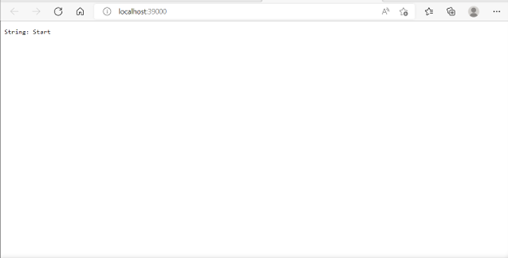
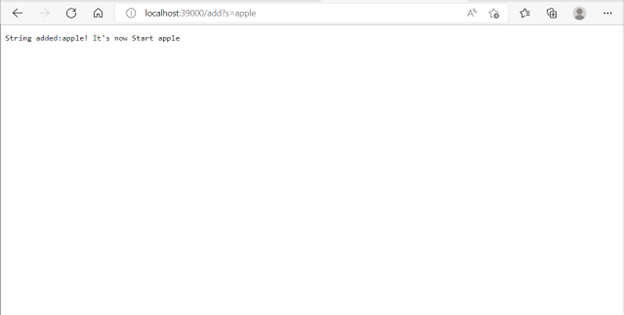
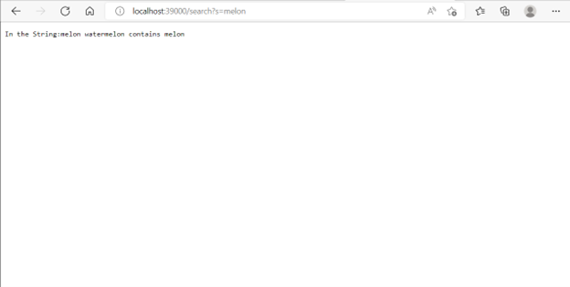
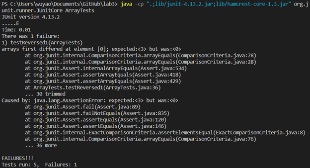

# This is lab report 2 # 

## For lab2 and lab3 ##

### Lab2 ###
* The code for Lab2 SearchEngine
```
import java.io.IOException;
import java.net.URI;

class Handler implements URLHandler {
    // The one bit of state on the server: a number that will be manipulated by
    // various requests.
    String ram = "Start";
    String after = "";
    public String handleRequest(URI url) {
        if (url.getPath().equals("/")) { //check if the path is /.
            return String.format("String: "+ ram);//shows the value of ram
        } else {//in the other cases
            System.out.println("Path: " + url.getPath());//shows Path: the path we have.
            if (url.getPath().contains("/add")) {//check if the path contains /add
                String[] parameters = url.getQuery().split("=");//split the query at =.
                if (parameters[0].equals("s")) {//check if stuff at the beginning of query is s
                    ram = ram + " " + parameters[1];//add the String in the query to ram.
                    return String.format("String added:" + parameters[1] + "! It's now " + ram);
                }
            }else if (url.getPath().contains("/search")){
                String[] parameters = url.getQuery().split("=");
                if (parameters[0].equals("s")) {
                    String check[] = ram.split(" ");
                    for(int i = 1; i < check.length ; i++) {
                        if (check[i].contains(parameters[1])) {
                            after = after + check[i] + " ";
                        }
                    }
                    return String.format("In the String:" + after + "contains " + parameters[1]);
                }
            }
            return "404 Not Found!";
        }
    }
}

class SearchEngine {
    public static void main(String[] args) throws IOException {
        if(args.length == 0){
            System.out.println("Missing port number! Try any number between 1024 to 49151");
            return;
        }

        int port = Integer.parseInt(args[0]);

        Server.start(port, new Handler());
    }
}

```

* check /


**Methods Called**
handleRequest; first if check.

**Values**
url.getPath = /; ram = Start; after = "".

**Values Change**
No values change.

* Add something


**Methods Called**
handleRequest; first if check; first if check in the else part.

**Values**
url.getPath().equals("/") = false; url.getPath().contains("/add") = true; parameters[0].equals("s") = true; ram = Srart apple;

**Values Change**
ram changes from *Start* to *Srart apple*.

* Search (in between I added melon and watermelon)


**Methods Called**
handleRequest; first if check; first if check in the else part; else if check in the else part.

**Values**
url.getPath().equals("/") = false; url.getPath().contains("/add") = false; url.getPath().contains("/search") = true; parameters[0].equals("s") = true; ram = Srart apple melon watermelon; after = melon watermelon;

**Values Change**
ram remains *Srart apple melon watermelon*; after changes from "" to "melon" then "melon watermelon".


### Lab3 ###
* **reversed** in ArrayExamples

**The failure-inducing input**
```
 @Test
  public void testReversed1() {
    int[] input1 = { 1, 2, 3};
    assertArrayEquals(new int[]{ 3, 2, 1 }, ArrayExamples.reversed(input1));
}
```

**The symptom**


expected value is { 3, 2, 1 }; actual output is { 0, 0, 0 }.

**The bug**

original code:
```
static int[] reversed(int[] arr) {
    int[] newArray = new int[arr.length];
    for(int i = 0; i < arr.length; i += 1) {
      arr[i] = newArray[arr.length - i - 1];
    }
    return arr;
}
```

fixed code:
```
static int[] reversed(int[] arr) {
    int[] newArray = new int[arr.length];
    for(int i = 0; i < arr.length; i += 1) {
      newArray[i] = arr[arr.length - i - 1];
    }
    return newArray;
}
```

**Connection between the symptom and the bug**
Bug: There is no value stored in newArray. 
Connection: Thus, each time we process the loop, we make the values of the original array arr 0. When we return arr at last, we get an array the same as newArray, which does not contain values.


