# Lab report 4 #

## For week-6 & week-7 ##

### Part-I: Lab-6 ###

we choose challenge.
```
/@Test<Enter>nn<shift><v>jjjjjykp/test<Enter>ea2<ESC>/ation<Enter>xxxxx:w<Enter>
```

Screenshots:

Step1: **vim TestDocSearch.java**

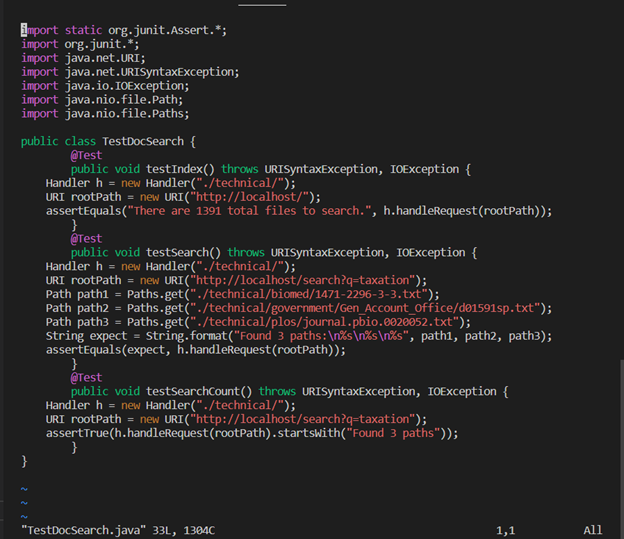

Step2:**/@Test**, find the position of @Test

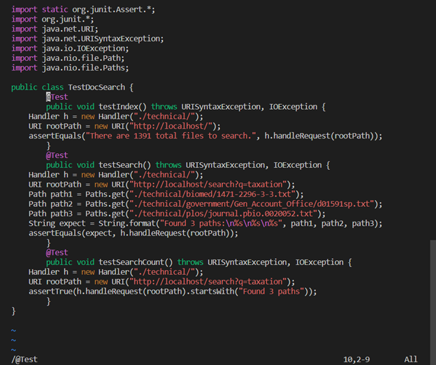

Step3: Press **n** twice 


Step4: **shift+v** Enter Visual mode


Step5: Press **j** five times to select code

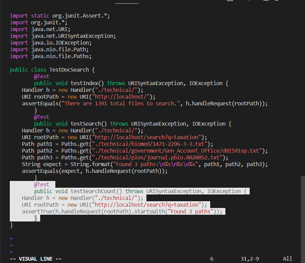

Step6: Press **y** to yank 

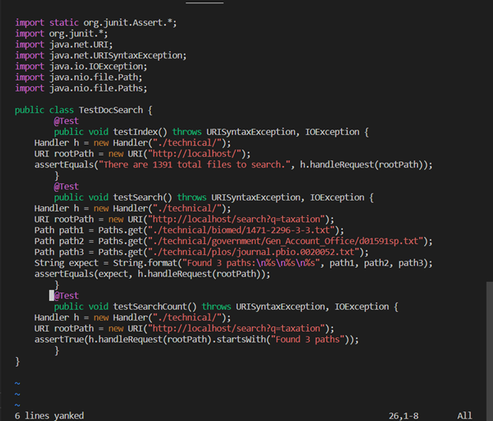

Step7: Press **k** to go up


Step8: Press **p** to paste

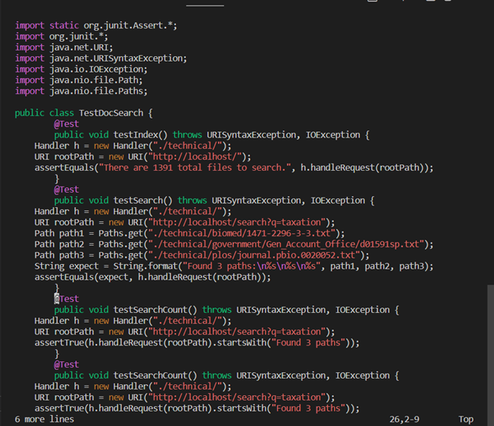

Step9:**/test, enter** Find where next test is

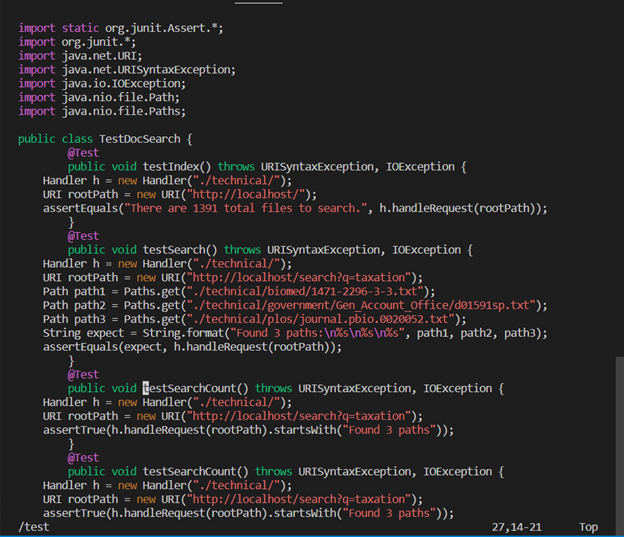

Step10: Press **e** to go to the end

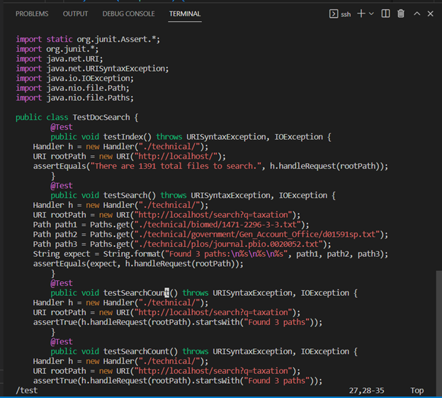

Step11: Press **a** to append

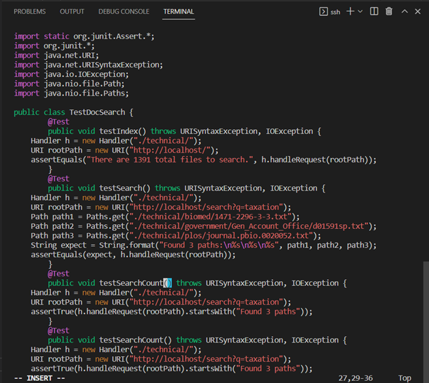

Step12: Press **2** to add

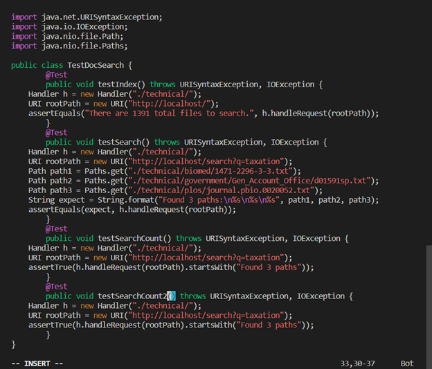

Step13: Press **esc** to quit visual mode and press **/ation** to search this string

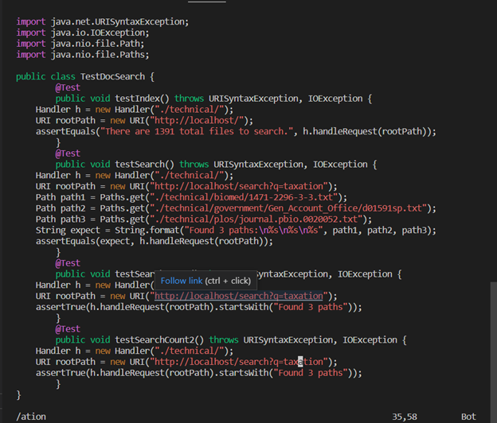

Step14: Press **x** five times to delete ation

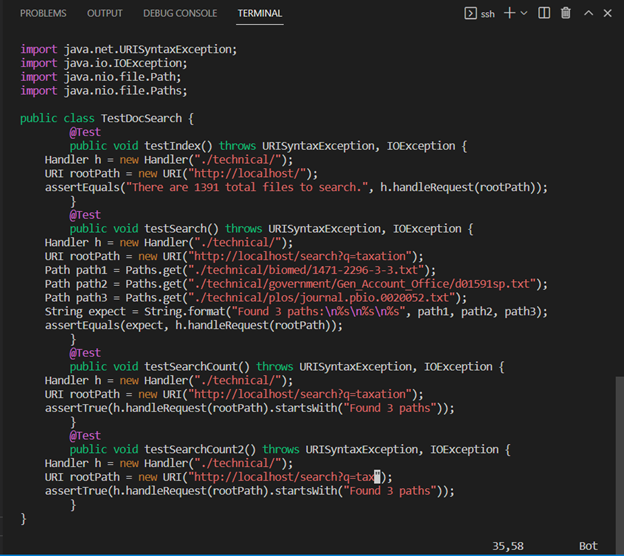

Step15: Press **:w,Enter** to save

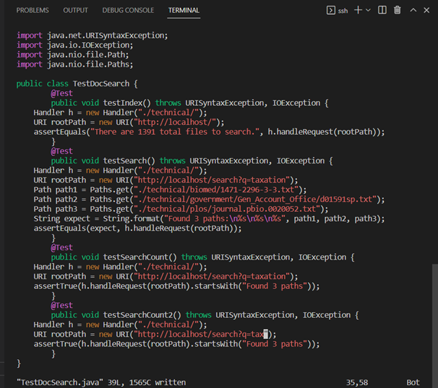


### Part-II: Lab-7 ###
*Time used:*

Start in Visual Studio Code: 23 mins

Start in ssh session: 20 mins

**Q:** Which of these two styles would you prefer using if you had to work on a program that you were running remotely, and why?

**A:** I prefer using the first one, which is starting in VSC. Although we need some time to login to the remote session, I prefer editing the code in the VSC. 

**Q:** What about the project or task might factor into your decision one way or another?

**A:** For me, it actually depends. If the project or task is simple and I can come up with the ideas easily, I would use ssh session. If I need to revise the code some times, I prefer using VSC for its code editing convinence. However, If I need to test and revise my work over and over again, I would stay in remote session since logining reversely at this time costs a lot of time.

